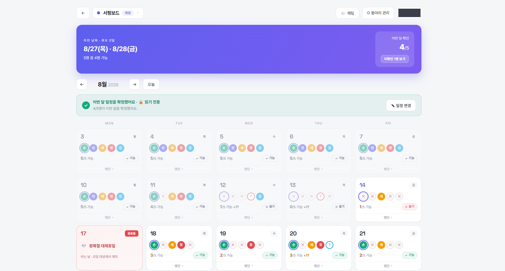
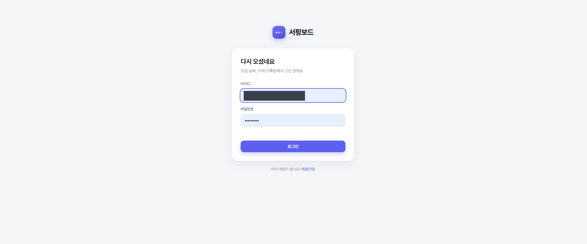
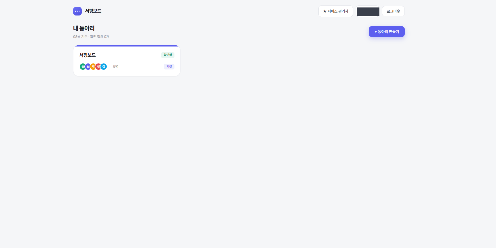
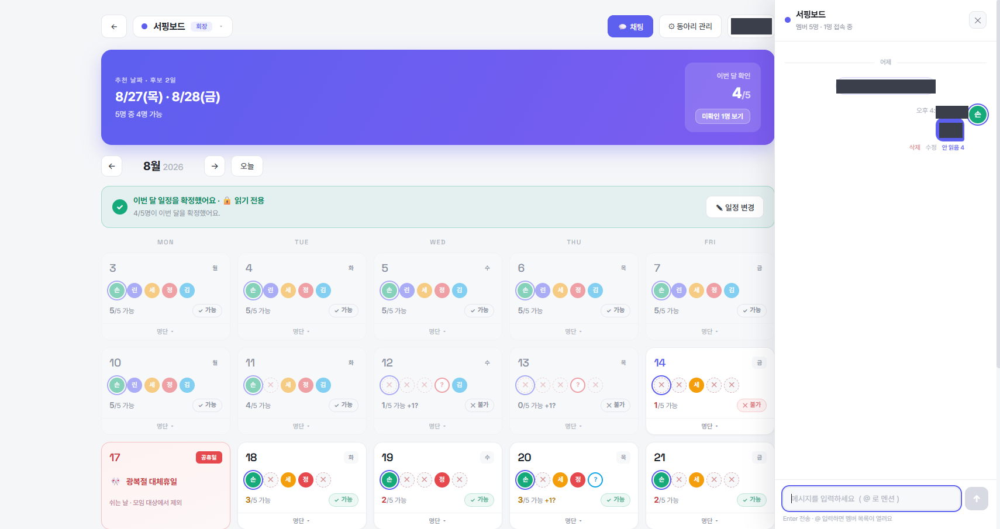
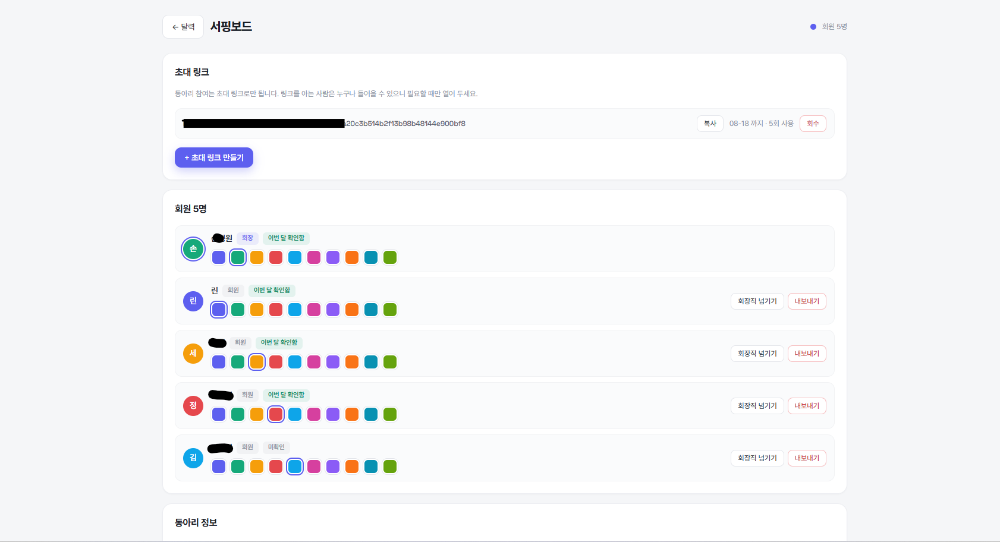

<div align="center">

# 🏄 서핑보드 일정

**모임 날짜, 이제 단톡방에서 그만 정해요**

되는 날을 고르지 않고 **안 되는 날만** 표시하면,<br/>
표시하지 않은 평일이 자동으로 "가능"으로 집계돼 달력에 날짜별 가능 인원이 바로 보입니다.

<br/>


<br/>



</div>

<br/>

## 🤔 왜 만들었나

단톡방에서 모임 날짜를 정하면 늘 이렇게 흘러갑니다.

> "다음 주 언제 되세요?" → 3일 뒤 → "저는 화요일 빼고 다 돼요" → "저는 목금만" → 스크롤 40개 → 결국 아무도 날짜를 모름

문제는 **되는 날을 묻는 것** 자체입니다. 사람은 자기가 되는 날을 잘 모르고, 안 되는 날만 압니다.

서핑보드는 질문을 뒤집습니다. 각자 **안 되는 날에 X만 찍으면** 나머지는 전부 가능으로 처리되고,
달력이 날짜별 가능 인원을 실시간으로 합산해 줍니다. 전원이 되는 날은 **풀파티**로 강조되고, 추천 날짜가 상단에 뜹니다.

<br/>

## ✨ 주요 기능

|  | |
|---|---|
| 🗓️ **평일 전용 달력** | 월~금만 그립니다. 공휴일은 후보에서 자동 제외되고 달력에 이유가 남습니다 |
| ✖️ **안 되는 날만 표시** | 표시하지 않은 날은 자동 "가능". 날짜별 가능 인원이 즉시 집계됩니다 |
| 🎉 **풀파티 · 추천 날짜** | 전원 가능한 날을 강조하고, 상단 히어로에 후보 날짜를 뽑아 줍니다 |
| 🔒 **월 단위 확정** | "내 일정 확정"으로 그 달을 잠그고 "일정 변경"으로 다시 엽니다. `이번 달 확인 4/5` 와 미확인 명단이 보입니다 |
| 💬 **동아리 채팅** | WebSocket 실시간. @멘션 · 읽음 표시 · 안 읽은 배지 · 메시지 수정/삭제 |
| 🏢 **멀티 동아리** | 한 사람이 여러 동아리에 속하고, 동아리마다 별도 달력을 가집니다 |
| 👑 **3단계 권한** | 서비스 관리자(전역) / 동아리 회장(동아리당 1명) / 일반 회원 |
| 🔗 **초대 링크 가입** | 동아리 참여는 만료·사용횟수가 있는 초대 링크로만 됩니다 |
| 📦 **컨테이너 1개** | 앱 하나 + SQLite 파일 하나. 백업은 파일 복사로 끝납니다 |
| 🚫 **빌드 도구 없음** | 번들러·트랜스파일러 없는 순수 HTML/CSS/JS. 폰트도 자체 호스팅이라 폐쇄망에서 그대로 돕니다 |

<br/>

## 🚀 빠르게 띄우기

```bash
# 1. 환경 파일 준비
cp .env.example .env
node -e "console.log(require('crypto').randomBytes(48).toString('hex'))"   # SESSION_SECRET 에 붙여넣기

# 2. 기동
npm run up          # docker compose up -d --build

# 3. 첫 서비스 관리자 계정 확인
npm run logs
```

`http://localhost:8888` 접속 → 관리자로 로그인 → **계정 설정에서 비밀번호 변경**.

> [!IMPORTANT]
> `.env` 의 `SESSION_SECRET` 과 `ADMIN_INITIAL_PASSWORD` 는 기본값 그대로 쓰지 마세요.
> 초기 관리자 계정은 **계정이 하나도 없을 때만** 생성되고, 이후로는 무시됩니다.

<br/>

## 📸 화면

### 로그인 · 회원가입

누구나 가입할 수 있고, 동아리 참여는 초대 링크로만 됩니다.



<br/>

### 내 동아리

속한 동아리와 이번 달 확인이 필요한 개수를 한눈에 봅니다.



<br/>

### 동아리 채팅

달력 옆 접이식 사이드 패널(380px). @멘션, 안 읽은 개수, 메시지 수정·삭제.



<br/>

### 동아리 관리

초대 링크 발급·회수, 회원 색상 지정, 회장직 위임, 내보내기.



<br/>

## 🧱 기술 스택

의존성 6개가 전부입니다. 프레임워크도, 빌드 파이프라인도 없습니다.

| 영역 | 선택 | 이유 |
|---|---|---|
| 서버 | **Express 4** | 라우팅과 미들웨어만 필요했습니다 |
| DB | **better-sqlite3** | 동기 API. 파일 하나라 백업이 `cp` 로 끝납니다 |
| 실시간 | **ws** | 단일 프로세스 인메모리 룸. 외부 브로커 없음, 끊기면 REST 폴백 |
| 인증 | **jsonwebtoken · bcryptjs · cookie-parser** | 세션 쿠키 기반. 외부 IdP 의존 없음 |
| 프론트 | **순수 HTML/CSS/JS** | 폐쇄망에서 CDN 없이 그대로 열려야 했습니다 |
| 테스트 | **node:test** | 런타임 내장. 테스트 러너 의존성 0 |

<br/>

## 🗂️ 폴더 구조

```
surfboard-scheduler/
├─ docker-compose.yml         앱 1개 + sqlite 볼륨 (포트 8888)
├─ Dockerfile                 better-sqlite3 네이티브 빌드용 2단계 이미지
├─ .env.example               복사해서 .env 로 사용
│
├─ server/
│  ├─ index.js                부팅: env → 마이그레이션 → 첫 서비스 관리자 생성 → listen
│  ├─ env.js                  .env 로더 (다른 모듈보다 먼저 import)
│  ├─ app.js                  express 조립, 보안 헤더, 정적 파일
│  ├─ db.js                   sqlite 연결 + 마이그레이션 실행기
│  ├─ auth.js                 비밀번호 해시, 세션 쿠키, requireAuth·requireServiceAdmin
│  ├─ ws.js                   WebSocket 업그레이드 · 멤버십 검증 · 룸 관리
│  ├─ lib/                    permissions · policies · holidays · calendar · chat · realtime …
│  ├─ migrations/             001_init · 002_multiclub · 003_chat
│  └─ routes/                 auth · clubs · calendar · chat · invites · notices · me · admin
│
├─ public/                    빌드 도구 없는 순수 프론트엔드 — 8화면
│  ├─ *.html                  login · signup · invite · clubs · club · club-admin · account · admin
│  ├─ css/app.css             디자인 토큰 + 컴포넌트 클래스
│  ├─ js/                     api.js · ui.js + 화면별 모듈
│  └─ fonts/                  Pretendard Variable · Space Grotesk (자체 호스팅, OFL)
│
├─ scripts/                   create-user · reset-password · backup · smoke.sh
├─ tests/                     node:test — 인증 · 권한 · 달력 API · 채팅
└─ data/                      surfboard.db 가 생기는 곳 (도커 볼륨) + backups/
```

<br/>

## 🛠️ 운영 명령

로컬에 Node·의존성을 깔지 않아도 됩니다. 전부 컨테이너 안에서 돕니다.

| 명령 | 하는 일 |
|---|---|
| `npm run up` | 빌드 + 기동 (`docker compose up -d --build`) |
| `npm run down` | 내리기 |
| `npm run restart` | 코드 고친 뒤 재시작 (`server/`·`public/` 만 고쳤으면 `up` 으로 재빌드) |
| `npm run logs` | 로그 따라보기 |
| `npm test` | 컨테이너 안에서 테스트 실행 |
| `npm run smoke` | 떠 있는 서버에 API 흐름 확인 (임시 계정을 만들고 스스로 지웁니다) |
| `npm run backup` | 서버를 내리지 않고 `data/backups/` 에 DB 복사 + `integrity_check` |

계정 관리도 컨테이너 안에서 합니다. 폐쇄망 초기 세팅용입니다.

```bash
npm run user:create -- gildong 홍길동                   # 계정 만들기 (비밀번호가 출력됩니다)
npm run user:create -- boss 사장님 --service-admin      # 서비스 관리자로 만들기
npm run user:passwd -- gildong                          # 비밀번호 초기화
```

<br/>

## 🧪 테스트

`node:test` 로 인증·권한 가드·달력 집계·채팅을 검증합니다.

```bash
npm test          # 컨테이너 안에서
npm run test:local  # 로컬 Node 20+ 에서
```

<br/>

## 📋 운영 메모

- 데이터는 `data/surfboard.db` **하나**입니다. `npm run backup` 이 서버를 내리지 않고
  완결된 복사본을 만들고 `integrity_check` 까지 합니다. 주 1회면 충분합니다.
- **폐쇄망 전제입니다.** HTTP + 사내망 안에서 씁니다. 외부 노출·HTTPS·이메일 인증은 범위 밖입니다.
  외부에 열려면 `docker-compose.yml` 의 프록시 프로파일을 켜고 `COOKIE_SECURE=true` 로 두세요.
- 폰트도 자체 호스팅합니다. CDN 을 불러오면 폐쇄망에서 글자가 깨집니다.
- 공휴일 목록은 `server/lib/holidays.js` 에 있습니다.
  **2026년은 대조를 마쳤고, 2027년 값은 연말에 손으로 추가해야 합니다.**
- `.env`, `data/*.db`, `data/backups/` 는 커밋하지 않습니다.

<br/>

## 📄 라이선스

[MIT](LICENSE) © 2026 손정원

번들된 폰트는 각자의 라이선스를 따릅니다 — [Pretendard (OFL)](public/fonts/pretendard-LICENSE.txt) · [Space Grotesk (OFL)](public/fonts/space-grotesk-OFL.txt).
